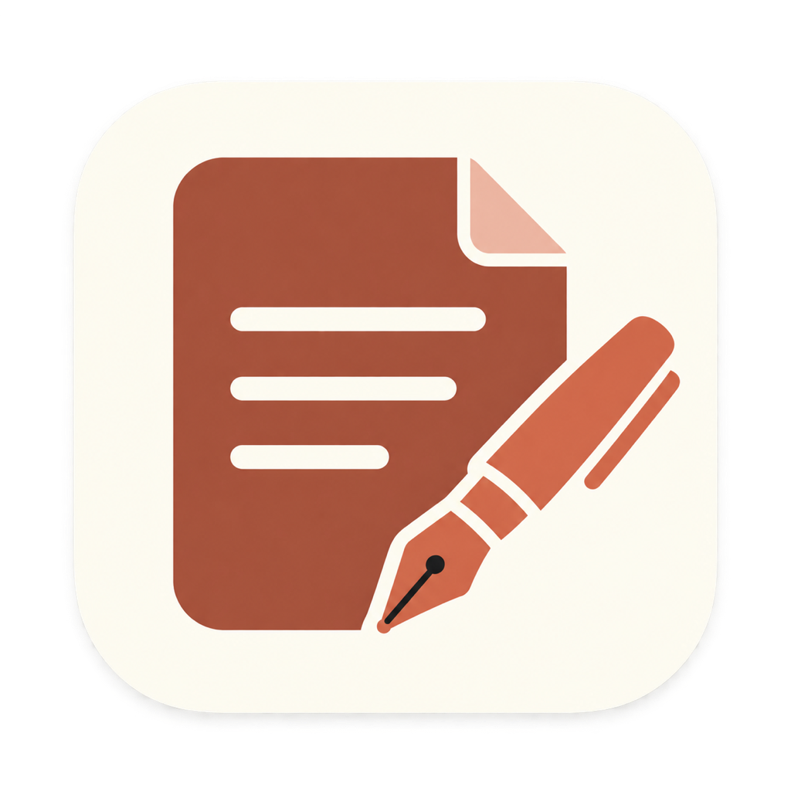

# RS Writer



Een native Markdown-schrijfapp voor **macOS 14 of nieuwer**, geïnspireerd op de rustige schrijfervaring van iA Writer. Gebouwd met SwiftUI, AppKit en WebKit. Eigen naam, code en vormgeving.

## Installeren

Download de nieuwste `RS-Writer-X.Y.Z-universal.dmg` via [GitHub Releases](https://github.com/yo-han/rs-writer/releases). Open de DMG, sleep **RS Writer** naar **Applications / Apps** en open de app vanuit Apps. De rustige achtergrond met pijl laat zien waar je de app naartoe sleept. Sluit bij een update eerst RS Writer af. Je teksten blijven in je gekozen bibliotheekmap.

Releases worden met Developer ID ondertekend en door Apple genotariseerd voordat de workflow ze publiceert. macOS kan bij de eerste start nog de normale bevestiging voor een gedownloade app tonen. De repository is privé; downloads zijn beschikbaar voor gebruikers met repositorytoegang.

## Lokaal starten

Open `RSWriter.xcodeproj` in Xcode. Selecteer het schema **RSWriter**, kies **My Mac** en druk op **⌘R**. Voor een lokale build zonder Apple-account:

```sh
./scripts/build.sh
```

De universele app voor Apple Silicon en Intel staat in `build/Build/Products/Release/RS Writer.app`. Deze lokale build heeft een ad-hoc-handtekening. Gebruik Developer ID voor verspreiding naar je andere Macs.

Klik in de app op **Kies je bibliotheekmap**. Kies een bestaande map of maak een nieuwe aan. RS Writer onthoudt die keuze met een macOS security-scoped bookmark. De meegeleverde map `Examples/Bibliotheek` is een vrijblijvende voorbeeldbibliotheek; er worden geen voorbeelden aan je eigen map toegevoegd.

## iCloud Drive of Proton Drive

1. Maak bijvoorbeeld een map `Schrijven` in **één** van deze diensten.
2. Laat deze map op elke Mac lokaal beschikbaar zijn. Kies in Finder bij iCloud Drive **Behoud download / Keep Downloaded** waar beschikbaar. Kies bij Proton Drive **Make available offline**.
3. Kies op elke Mac in RS Writer diezelfde gesynchroniseerde map. Het lokale pad mag per Mac verschillen.
4. Laat de drive synchroniseren voordat je op een andere Mac verdergaat.

De bestanden zijn gewone UTF-8 `.md`-bestanden. Ook `.markdown`, `.mdown` en `.txt` verschijnen in de bibliotheek. Submappen worden meegenomen. Je kunt bestanden via Finder of een andere editor toevoegen, verplaatsen of wijzigen. De app controleert de map ongeveer elke drie seconden.

RS Writer voert geen cloud-login of eigen synchronisatie uit. iCloud Drive of Proton Drive verzorgt het transport. **‘Opgeslagen’ betekent lokaal op de drive opgeslagen, niet dat alle andere Macs de wijziging al hebben ontvangen.** Markeer je schrijfmap als offline beschikbaar, zodat je kunt blijven schrijven zonder netwerk. Kies geen map die door twee verschillende synchronisatiediensten tegelijk wordt beheerd.

Bronnen: [Apple: werken met iCloud Drive](https://support.apple.com/en-us/109344), [Proton Drive op macOS](https://proton.me/support/drive-macos-guide), [Proton on-demand sync](https://proton.me/support/proton-drive-macos-on-demand-sync).

## Schrijven

- Bibliotheek met submappen, zoeken op bestandsnaam/pad, sorteren en lokale favorieten.
- Documenten en mappen aanmaken; documenten hernoemen; een kopie bewaren via **Bewaar als**.
- Automatisch opslaan na ongeveer 650 ms zonder typen, plus **⌘S**.
- Native teksteditor met undo/redo, spelling, Markdown-accenten, lijstvervolg en opmaaksneltoetsen.
- Alineafocus, typemachinemodus, instelbare tekstbreedte en lettergrootte.
- Markdown-preview met koppen, lijsten, taken, tabellen, code, links en lokale afbeeldingen.
- Documentinhoud met klikbare koppen; woord- en tekentelling; geschatte leestijd.
- Licht, donker of systeemthema.
- HTML-export en print/PDF via het macOS-printvenster. Open eerst de preview met **⌘R**. Kies daarna **Print / exporteer PDF**, en **PDF → Bewaar als PDF**.

| Actie | Sneltoets |
| --- | --- |
| Nieuw document | ⌘N |
| Kies bibliotheekmap | ⌘O |
| Bewaar | ⌘S |
| Bewaar als | ⇧⌘S |
| Zoek in document | ⌘F |
| Vet / cursief / link | ⌘B / ⌘I / ⌘K |
| Preview | ⌘R |
| Bibliotheek tonen/verbergen | ⇧⌘L |
| Focus op huidige alinea | ⇧⌘F |
| Typemachinemodus | ⇧⌘T |
| Documentinhoud | ⇧⌘O |

Afbeeldingen in de preview moeten lokaal binnen de gekozen bibliotheek staan, bijvoorbeeld ``. Externe afbeeldingen worden niet automatisch opgehaald. Scripts en actieve HTML worden uit de preview verwijderd. Bij HTML-export blijven afbeeldingspaden relatief: bewaar de HTML naast het Markdown-bronbestand of kopieer de bijbehorende afbeeldingen mee.

## Bescherming van je tekst

Schijfwerk gebeurt buiten de UI-thread. Bestandsacties gebruiken `NSFileCoordinator`. Voor opslaan vergelijkt RS Writer de huidige bytes op de drive met de versie die je hebt geopend.

- Bij een externe wijziging zonder lokale edits wordt de editor vernieuwd.
- Bij externe én lokale wijzigingen blijft het originele bestand behouden. Je lokale tekst komt in een apart bestand met `conflict`, datum en unieke code in de naam.
- Bij een verdwenen bestand of niet-bereikbare drive wordt het origineel niet stilzwijgend opnieuw gemaakt.
- Nog niet opgeslagen tekst en de bijbehorende oorspronkelijke versie worden lokaal bewaard. Na herstart kan de editor die tekst herstellen. **Herstelkopieën bewaren** schrijft losse bestanden naar de gekozen bibliotheek, ook wanneer het oorspronkelijke bestand ontbreekt.
- Nieuwe bestanden en hernoemacties overschrijven geen bestaande bestanden.

De herstelgegevens en voorkeuren staan lokaal in de sandbox van de app, in de macOS-voorkeuren voor je bundle identifier. Ze worden niet door RS Writer naar een server verstuurd. Dit is bescherming tegen gewone opslagconflicten, geen realtime samenwerking: bij gelijktijdig offline bewerken op twee Macs kan de clouddienst zelf aanvullende conflictbestanden maken. Een onafhankelijke back-up blijft nuttig.

## Een release maken

Werk na een batch wijzigingen [CHANGELOG.md](CHANGELOG.md) en het projectversienummer bij en push een overeenkomende versietag, bijvoorbeeld `v0.1.0`. GitHub Actions bouwt Apple Silicon en Intel in één app, ondertekent met Developer ID, notarizet en verifieert app en DMG, en publiceert daarna de download met changelog en SHA-256-checksum.

De eenmalige inrichting van de Apple-secrets en de volledige releaseprocedure staan in [docs/RELEASING.md](docs/RELEASING.md). Certificaten en wachtwoorden horen niet in de repository. Een lokale preview van de installer maak je na een build met `./scripts/preview-dmg.sh`; die heet expliciet `UNSIGNED-PREVIEW` en wordt nooit door de releaseflow gepubliceerd.

De app gebruikt App Sandbox, door de gebruiker gekozen lees-/schrijftoegang, security-scoped bookmarks en Hardened Runtime. Er is geen CloudKit-container nodig.

## Ontwikkeling en tests

```sh
./scripts/test.sh
./scripts/build.sh
```

De Swift Package-tests verifiëren bestanden aanmaken, conflictbehoud, normale saves, ontbrekende bestanden, naamvalidatie, Unicode/CRLF, mapdetectie en herstel van de oorspronkelijke versie na herstart. De tests hebben toegang tot de normale macOS-bestandscoördinatieservice nodig.

`project.yml` is de bron voor het meegeleverde Xcode-project. Na structurele projectwijzigingen kun je het opnieuw genereren met [XcodeGen](https://github.com/yonaskolb/XcodeGen): `xcodegen generate`. Gewoon bouwen vereist geen XcodeGen of npm.

De preview gebruikt gebundelde [Marked 15.0.12](https://marked.js.org/) en [DOMPurify 3.4.15](https://github.com/cure53/DOMPurify). Licenties staan in `Resources`. Er zijn geen runtime-downloads of externe lettertypen.

## Status en verschillen met iA Writer

Dit is een werkende **0.1-versie van de kernworkflow**, geen volledige één-op-één-vervanging. Nog niet aanwezig: auteurschap/tracking, taalkundige stijlanalyse, DOCX-export, publicatie-integraties, geavanceerde templates, tags, zoeken in de hele bibliotheekinhoud, een command palette en focus per zin. Bestanden verplaatsen en verwijderen kan via Finder. De app opent op dit moment één schrijfvenster en heeft een limiet van 10 MB per tekstbestand.

Lokale bouw- en opslagtests en een UI-praktijktest zijn uitgevoerd. De synchronisatie tussen twee fysieke Macs via iCloud Drive of Proton Drive en Developer ID-notarization zijn nog niet end-to-end getest.
